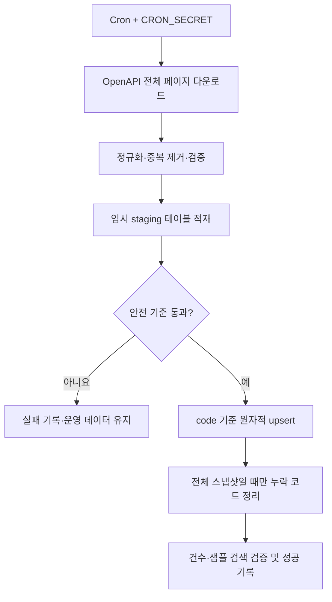

# 한국 지역검색 및 행정구역 최신화 배치 인수인계서

작성일: 2026-07-22

운영 서비스: Image Partners

대상 기능: 사진 업로드 화면의 촬영장소 자동완성

## 1. 목적과 현재 상태

사진 작가가 `서교동`처럼 일부 지역명만 입력해도 `서울특별시 마포구 서교동`과 같은 법정동 계층 주소를 선택할 수 있도록 한국 지역검색을 도입했다.

현재 운영 DB에는 행정안전부 행정표준코드관리시스템의 현행 법정동 전체 자료(기준일 2026-07-08) 20,560건이 적재되어 있다. 최초 적재와 검색 RPC는 다음 마이그레이션으로 배포되었다.

- `supabase/migrations/055_administrative_area_search.sql`: 테이블·검색 인덱스·권한·초기 데이터
- `supabase/migrations/056_search_administrative_areas.sql`: 순위 기반 검색 RPC
- 운영 적용 상태: 055, 056 적용 완료
- 운영 검증: `서교동` 검색 시 `서울특별시 마포구 서교동` 반환 확인

이번 릴리스에는 자동 최신화 배치 자체는 포함하지 않는다. 아래 설계는 후속 구현자가 공공데이터포털 OpenAPI를 연계해 안전하게 정기 동기화하기 위한 기준이다.

## 2. 사용자 요청 흐름


행정구역명은 공공데이터이므로 검색 API는 로그인 여부와 관계없이 호출할 수 있다. 단, DB 테이블과 RPC는 공개하지 않고 애플리케이션 API만 service role로 접근한다. API에는 IP당 분당 120회 제한과 최대 8개 결과 제한이 적용되며, 성공 응답은 CDN에서 캐시한다. 업로드 화면 자체는 기존 인증과 승인 작가 접근 제어를 유지한다.

## 3. 데이터 모델과 불변 조건

`public.administrative_areas`의 기준 키는 행정안전부가 제공하는 10자리 법정동 코드다.

| 컬럼 | 의미 | 동기화 규칙 |
| --- | --- | --- |
| `code` | 10자리 법정동 코드, PK | 충돌 키. 문자열로 보존하고 숫자로 변환하지 않는다. |
| `full_name` | 시도부터 현재 단계까지의 전체 지역명 | 원본의 지역주소명으로 갱신한다. |
| `leaf_name` | 최하위 지역명 | 원본의 최하위지역명으로 갱신한다. |
| `level` | `sido`, `sigungu`, `eup_myeon_dong`, `ri` | 코드 자리와 상위지역 관계로 결정한다. |
| `source_updated_on` | 원천 자료 기준일 | `YYYY-MM-DD`로 정규화한다. |
| `updated_at` | DB 반영 시각 | upsert가 실제 실행될 때 `now()`로 갱신한다. |

핵심 원칙은 `ON CONFLICT (code) DO UPDATE`다. 행정구역 명칭이나 계층 정보가 바뀌어도 같은 법정동 코드는 한 행으로 유지한다. 이름을 키로 사용하면 개명 시 중복이 생기므로 금지한다.

```sql
insert into public.administrative_areas
  (code, full_name, leaf_name, level, source_updated_on)
values
  (:code, :full_name, :leaf_name, :level, :source_updated_on)
on conflict (code) do update set
  full_name = excluded.full_name,
  leaf_name = excluded.leaf_name,
  level = excluded.level,
  source_updated_on = excluded.source_updated_on,
  updated_at = now();
```

RLS가 활성화되어 있고 `anon`, `authenticated`에는 테이블 접근권한이 없다. 동기화 배치와 서버 검색 API만 `service_role`을 사용한다.

## 4. 원천 데이터 계약

우선 연계 대상은 공공데이터포털의 [행정안전부 행정표준코드 법정동코드 OpenAPI](https://www.data.go.kr/data/15077871/openapi.do)다.

- 서비스: `StanReginCd`
- 목록 기능: `getStanReginCdList`
- 형식: JSON 우선, XML은 장애 시 대체 수단
- 인증: 공공데이터포털 `ServiceKey`
- 호출 방식: `pageNo`와 `numOfRows`를 사용한 전체 페이지 순회
- 주요 원본 필드: `locatjijuk_cd`, `locatadd_nm`, `locallow_nm`, `locathigh_cd`, `adpt_de`

필드 매핑은 다음을 기준으로 한다.

| OpenAPI | 내부 컬럼 | 처리 |
| --- | --- | --- |
| `locatjijuk_cd` | `code` | 정확히 10자리인지 검증 |
| `locatadd_nm` | `full_name` | trim 후 연속 공백 정리 |
| `locallow_nm` | `leaf_name` | trim 후 빈 값 금지 |
| 코드 자리·`locathigh_cd` | `level` | 계층 규칙으로 변환 |
| `adpt_de` | `source_updated_on` | `YYYYMMDD`를 날짜로 변환 |

다운로드 경로 `/Users/simini/Downloads/CH_D001_00_20260715`의 EMD/LIO 공간자료는 2026-07-15 변경분을 확인하는 보조 자료다. 전국 현행 코드 전체 스냅샷이 아니므로 누락 행 삭제의 기준이나 단독 초기 적재원으로 사용하면 안 된다. 지도 경계가 필요해질 때만 별도 공간 테이블로 관리하고, 현재 자동완성 테이블에는 geometry를 넣지 않는다.

## 5. 정기 최신화 배치 설계

권장 주기는 매일 1회다. 원천 API는 실시간 갱신이지만 지역 코드 변경 빈도가 낮으므로 전체 스냅샷을 야간에 가져오는 방식이 단순하고 복구하기 쉽다.



구현 권장 위치:

- `src/app/api/cron/refresh-administrative-areas/route.ts`: cron 진입점
- `src/lib/locations/mois-client.ts`: 페이지 조회, 재시도, 응답 스키마 검증
- `src/lib/locations/administrative-area-sync.ts`: 정규화, staging, transaction 호출
- 신규 SQL 마이그레이션: staging 처리 RPC와 동기화 실행 이력 테이블
- `vercel.json`: 기존 cron과 겹치지 않는 야간 시간대로 일정 추가

Vercel Cron은 `Authorization: Bearer ${CRON_SECRET}` 검증을 반드시 통과해야 한다. 공공데이터 인증키는 예를 들어 `MOIS_ADMINISTRATIVE_AREA_SERVICE_KEY`라는 서버 전용 환경변수로 두고 `NEXT_PUBLIC_` 접두사를 사용하지 않는다.

### 배치 처리 순서

1. 모든 페이지를 수집하고 원천의 전체 건수와 수집 건수가 일치하는지 확인한다.
2. 코드·이름·날짜를 정규화하고 `code` 중복을 제거한다. 같은 코드에 서로 다른 이름이 있으면 실패시킨다.
3. 10자리 코드, 허용 level, 빈 이름, 미래 기준일을 검증한다.
4. staging 테이블에 한 실행분을 적재한다.
5. 단일 DB transaction 안에서 `code` 기준 upsert를 실행한다.
6. 원천이 **전체 현행 스냅샷임이 확인된 실행에서만** staging에 없는 코드를 삭제하거나 비활성화한다. 일부 페이지나 변경분 자료로 누락 코드를 정리하지 않는다.
7. 적용 후 건수와 대표 검색어를 검증하고 실행 결과를 기록한다.

초기 버전은 물리 삭제보다 `is_active` 컬럼을 추가해 폐지 코드를 비활성화하는 방식을 권장한다. 검색 RPC에는 `where is_active` 조건을 추가하면 되고, 이력 조사와 롤백이 쉬워진다. 해당 변경은 별도 마이그레이션으로 수행한다.

## 6. 안전 기준과 장애 처리

다음 조건 중 하나라도 발생하면 upsert transaction을 시작하지 않거나 rollback한다.

- HTTP 오류, 인증 오류, JSON/XML 파싱 오류
- 페이지 누락 또는 원천 전체 건수 불일치
- 정상 실행 대비 행 수가 5% 이상 급감
- 10자리 형식이 아닌 코드 또는 중복 코드 충돌
- `full_name`, `leaf_name`, `source_updated_on` 누락
- 기준일이 미래이거나 직전 성공 실행보다 오래됨
- 동기화 후 대표 검색어 `서울특별시`, `서교동`, `제주특별자치도` 중 하나라도 결과 없음

외부 API는 429와 5xx에 한해 지수형 backoff로 제한 횟수 재시도한다. 영구 실패 시 기존 `administrative_areas`는 그대로 유지하고 운영 로그와 관리자 알림에 실패 원인을 남긴다. 비밀키와 원문 전체 응답은 로그에 남기지 않는다.

권장 실행 이력 필드:

- `started_at`, `finished_at`, `status`
- `source_updated_on`, `source_total`, `fetched_count`
- `inserted_count`, `updated_count`, `deactivated_count`
- `error_code`, 비밀정보를 제거한 `error_message`
- 재현을 위한 응답 checksum

## 7. 운영 검증

배포 또는 정기 동기화 후에는 service role을 사용한 서버 측 점검으로 다음을 확인한다. 키 원문은 출력하지 않는다.

```sql
select count(*) from public.administrative_areas;

select *
from public.search_administrative_areas('서교동', 8);

select max(source_updated_on), max(updated_at)
from public.administrative_areas;
```

애플리케이션 검증:

1. 승인된 작가 계정으로 `/dashboard/uploads/new` 접속
2. 촬영장소에 `서교동` 입력
3. `서울특별시 마포구 서교동` 선택 가능 여부 확인
4. 선택한 전체 지역명이 업로드 저장 요청에 유지되는지 확인
5. 비로그인 검색도 200으로 공공 행정구역만 반환하고, 과도한 요청은 429인지 확인

## 8. 롤백

- 앱 장애: 직전 Vercel Production 배포를 promote한 뒤 공개 API와 업로드 화면을 다시 점검한다.
- 최신화 배치 장애: transaction rollback을 기본으로 하며 기존 검색 데이터는 유지한다.
- 잘못된 데이터가 commit된 경우: 직전 성공 스냅샷을 staging에 재적재하고 동일한 `code` 기반 upsert를 재실행한다.
- RPC 장애: 직전 함수 정의를 새 마이그레이션으로 복원한다. 적용된 마이그레이션 파일을 수정하거나 이력을 되돌리지 않는다.

## 9. 완료 조건

- OpenAPI 전체 페이지 수집과 건수 검증 테스트가 있다.
- 정규화·level 판정·중복 코드·실패 보존 테스트가 있다.
- DB 작업은 한 transaction이며 중간 실패 시 운영 테이블이 변하지 않는다.
- service role 외 테이블/RPC 접근이 차단되어 있다.
- cron 인증, timeout, 재시도, 로그 마스킹이 검증되어 있다.
- staging 대비 운영 반영 건수와 대표 검색 결과를 자동 확인한다.
- 운영 환경변수와 cron 일정이 설정되고 첫 수동 실행 결과를 기록한다.
