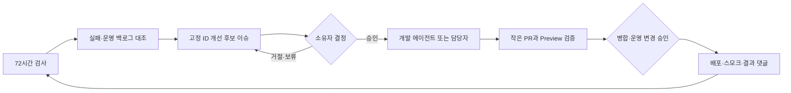

# 72시간 유지보수 루틴

> 상태: 기준
> 적용일: 2026-08-06
> 실행 워크플로: `.github/workflows/maintenance-routine.yml`

## 목적과 경계

운영 상태와 시스템 정의의 차이를 72시간마다 발견하는 데서 멈추지 않고, 개선 후보 도출 → 결정 요청 → 작은 변경 → 검증 → 승인된 배포 → 결과 회고를 반복한다. 각 후보와 결정, PR, 배포 결과는 GitHub 이슈에 누적되어 다음 주기의 입력이 된다.

GitHub Actions에는 현재 코드를 설계·수정할 AI 실행 자격증명이 없다. 따라서 예약 실행이 임의 코드를 만들었다고 가장하지 않는다. 지금 자동화되는 범위는 다음과 같다.

- 검사 결과와 `operations-backlog.md`를 대조해 P0/P1 개선 후보를 결정론적으로 도출한다.
- 후보마다 고정 ID를 가진 이슈를 생성하거나 최신 근거로 갱신하고, 해결된 후보는 자동 종료한다.
- 저장소 권한자의 승인·거절 댓글을 검증하고 승인 대기열에 기록한다.
- 승인된 후보를 개발 에이전트 webhook에 넘길 수 있으며, 미연결이면 이슈를 작업 명세로 유지한다.
- 승인 후 수동 배포 워크플로가 검증·운영 스모크와 결과 댓글을 남긴다.

에이전트 연결 뒤에도 PR 병합, 운영 DB 적용, 데이터 삭제와 운영 배포는 각각의 명시적 승인 경계를 유지한다. 이는 개선을 하지 않는다는 뜻이 아니라 되돌리기 어려운 변경을 예약 작업의 판단만으로 실행하지 않는다는 뜻이다.

## 실행 주기

- GitHub Actions 예약은 매일 00:41 UTC(한국시간 09:41)에 기동한다.
- 마지막 성공 댓글의 `imagepartners-maintenance-success` 표식으로부터 259,200초(72시간)가 지난 경우에만 전체 점검한다.
- 실패 실행에는 성공 표식을 남기지 않으므로 다음 날 다시 점검한다.
- `workflow_dispatch`의 `force=true`로 언제든 전체 점검을 수동 실행할 수 있다.
- 동시 실행은 하나만 허용하며 진행 중인 실행을 새 실행이 취소하지 않는다.

## 한 주기의 산출물



후보 이슈에는 관찰 근거, 제안 작업, 완료 기준, 변경 분류, 기준 커밋과 최신 실행 링크가 들어간다. 같은 원인은 같은 `MNT-…` ID를 사용하므로 반복 발생 횟수와 판단 과정이 한곳에 쌓인다.

## 자동 점검 항목

| 영역 | 검사 |
| --- | --- |
| 공급망 | lockfile 기반 설치, 전체 의존성 high 이상 audit |
| 코드 | TypeScript, ESLint, Vitest, Next.js production build |
| DB | 고정 Supabase CLI로 빈 로컬 DB에 전체 migration 적용, schema lint |
| 운영 | `/api/health`의 DB·Storage·미리보기·AI 상태 |
| 공개 화면 | 홈, 라이브러리, 문의, 이용약관, 개인정보처리방침, 사업자정보, 이미지 API smoke |
| 거래 경계 | 계좌정보와 공시 또는 제한 베타 플래그가 모순 없이 유료 주문 가능 상태를 구성하는지 검사 |
| 변경 통제 | `main` branch protection 조회를 시도하고 권한 부족 또는 미설정을 보고 |

점검 결과는 `[maintenance] Image Partners 72-hour review` 이슈의 댓글과 GitHub Actions 요약에 기록한다. 개선 후보는 `maintenance-candidate`, `approval-required`, 우선순위 라벨을 가진 별도 이슈가 된다. 동일 항목을 새 이슈로 반복 생성하지 않는다.

GitHub 러너의 기존 서비스와 포트가 겹쳐 가짜 DB 장애 후보가 생기지 않도록, 각 실행 ID에서 계산한 20000번대 전용 포트를 `supabase/config.toml` 작업 사본에만 적용한다. 저장소의 로컬 개발 포트와 운영 DB 설정은 바꾸지 않는다.

## 승인과 구현

저장소 `OWNER`, `MEMBER`, `COLLABORATOR`만 후보 본문의 명령으로 결정을 기록할 수 있다.

```text
/approve MNT-XXXXXXXXXX
/reject MNT-XXXXXXXXXX
```

승인은 해당 후보의 구현 착수 승인이다. 운영 배포, DB migration 적용, 운영 데이터 수정·삭제까지 포괄 승인하지 않는다. 승인을 받으면 다음 중 하나로 진행한다.

1. `MAINTENANCE_AGENT_WEBHOOK_URL`이 설정된 경우 승인 이벤트와 후보 이슈 URL을 개발 에이전트에 전달한다.
2. 연결되지 않은 경우 `maintenance-approved` 라벨의 이슈가 사람 또는 Codex가 이어받을 작업 대기열이 된다.
3. 담당자는 이슈를 기준으로 작은 `codex/…` 브랜치와 PR을 만들고 `maintenance` 라벨, 후보 이슈 링크, 테스트 근거를 남긴다.
4. CI와 Preview 검증 뒤 병합 승인을 받는다.

webhook 수신자는 GitHub 이슈를 다시 읽어 최신 요구와 시스템 문서를 확인해야 한다. payload는 저장소, 후보 ID, 이슈 번호·URL만 신뢰 가능한 식별자로 제공하며 코드 변경 명령 자체를 포함하지 않는다.

현재 환경에는 Codex 예약 자동화 또는 이 webhook의 실행 URL·자격증명이 설정돼 있지 않다. 따라서 승인 후 자동 코딩은 아직 비활성이고 이슈 대기열까지가 실제 자동화 경계다. Codex scheduler/API가 준비되면 다음 secret을 설정해 연결한다.

- `MAINTENANCE_AGENT_WEBHOOK_URL`: 승인된 작업과 정기 검토 이벤트 수신 URL
- `MAINTENANCE_AGENT_WEBHOOK_TOKEN`: 선택적 Bearer 인증 토큰

## 배포와 결과 누적

`.github/workflows/deploy.yml`은 수동 실행만 허용하고 `production` Environment를 사용한다. 실행 시 승인 근거를 필수로 입력하고, 유지보수 후보라면 이슈 번호도 입력한다. 배포 전 전체 검증, Vercel 운영 배포, health와 공개 핵심 경로 스모크를 수행하고 성공·실패, 커밋, 실행 URL, 배포 URL을 후보 이슈에 댓글로 남긴다.

GitHub 저장소 설정에서 `production` Environment required reviewer를 지정해야 UI 승인 게이트도 강제된다. 설정 전에는 수동 `workflow_dispatch` 자체가 명시적 실행 동작이지만 별도 승인자가 강제되는 것은 아니다. DB migration과 데이터 작업은 이 배포 워크플로 범위 밖이며 각각 별도 계획·승인이 필요하다.

## 실패 처리

1. audit, build, fresh migration, DB lint 또는 운영 health 실패는 우선 P0 가능성으로 검토한다.
2. 테스트·타입·공개 경로·거래 경계 실패는 사용자 영향과 운영 재현 여부에 따라 P0 또는 P1로 분류한다.
3. branch protection을 확인하지 못한 경우 기존 변경 통제 P0에 근거를 누적한다.
4. 관련 로그에 비밀값·개인정보·비공개 이미지 URL이 없는지 확인한다.
5. 후보 이슈에서 승인 또는 거절 결정을 요청한다.
6. 승인된 경우 원인을 재현하고 문서·테스트를 포함한 작은 PR을 만든다.
7. Preview 또는 격리 환경 검증과 병합 승인을 받은 뒤에만 운영 배포한다.
8. 배포와 스모크 결과를 후보 이슈에 남기고 다음 주기에서 완료 여부를 재평가한다.

## 운영자가 확인할 것

- 예약 워크플로가 저장소 기본 브랜치에서 활성화돼 있는지
- `issues: write` 권한으로 추적 이슈와 댓글을 생성할 수 있는지
- 첫 수동 실행 후 추적 이슈와 성공 표식이 생성됐는지
- 72시간 이내 일일 실행이 전체 검사를 건너뛰는지
- 실패 실행 다음 날 전체 점검이 재시도되는지
- 동일 후보가 새 이슈를 만들지 않고 같은 ID·이슈에 갱신되는지
- 백로그에서 완료 처리된 후보가 다음 주기에 자동 종료되는지
- 승인 댓글 작성자의 저장소 권한과 후보 ID가 검증되는지
- `production` Environment에 required reviewer가 설정돼 있는지

워크플로 자체가 장기간 실행되지 않으면 GitHub Actions 비활성화, 저장소 일정 실행 지연 또는 권한 변경을 먼저 확인한다. GitHub 예약 실행은 정확한 시각의 SLA가 아니므로 장애 감시는 기존 15분 운영 health 모니터가 계속 담당한다.

## 최초 활성화 검증

2026-08-06 KST에 커밋 `fe9c881`로 첫 강제 실행을 수행했다. 의존성 audit, 타입, 린트, 테스트, 빌드, 001~067 fresh migration, DB lint, 운영 health·공개 경로·계좌이체 경계를 모두 통과했고 추적 이슈 `#26`에 성공 댓글이 생성됐다. 직후 `force=false` 실행에서는 간격 확인 job만 성공하고 전체 review job이 건너뛰어 72시간 게이트가 정상임을 확인했다.

`main` 보호 상태는 워크플로 토큰으로 확인되지 않아 기존 변경 통제 P0로 유지한다. 이 최초 실행은 후보 이슈 자동 생성과 승인 workflow를 추가하기 전의 기준 실행이며, 개선 루프 최초 검증 결과는 후속 실행 기록으로 추가한다.
