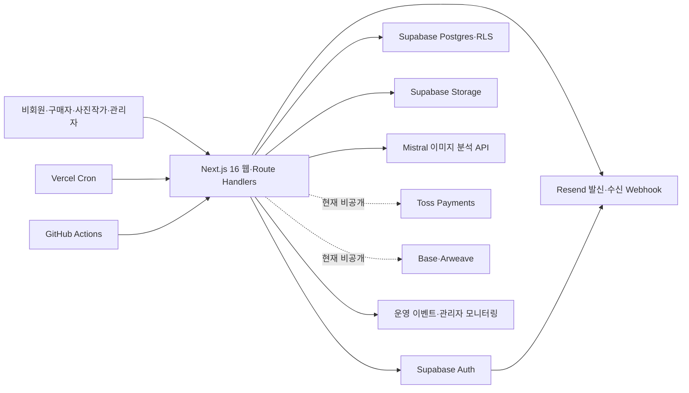

# Image Partners 시스템 정의서

> 상태: 기준
> 기준일: 2026-08-13
> 대상 환경: `https://www.imagepartners.kr` 운영 및 로컬 Supabase 개발 환경
> 변경 규칙: [문서 기반 개발 규칙](./document-driven-development.md)

## 1. 시스템 목적과 현재 운영 경계

Image Partners는 기존 거래처 실무자가 익숙한 라이브러리 중심 화면에서 이미지를 검색·열람하고, 이미지 요청과 라이선스 이용을 진행하는 국내 B2B 이미지 서비스다. 첫 화면은 장문의 가치 설명보다 검색·탐색·요청 행동을 우선한다. 공개 이미지 수는 사업 전략상 사용자에게 총량으로 노출하지 않는다.

현재 제공 범위는 다음과 같다.

- 공개 라이브러리 텍스트·사진 지문 검색, 분류·상세·유사 이미지 탐색
- 이미지 요청 및 운영자·사진작가 후속 처리
- 무료 사용권 확정
- 유료 이미지의 계좌이체 요청, 관리자 입금 확인, 원본 다운로드 권한 제공
- 사진작가 신청·승인, 이미지 업로드, Mistral 기반 제목·설명·키워드 보조 생성
- 관리자 이미지 검토·공개·반려·삭제·데이터 운영주기·사업 공시·콘텐츠 운영

온라인 Toss 결제, 정기 구독과 온체인 결제는 구현 흔적과 관리 기능이 존재하지만 공개 범위가 아니다. `NEXT_PUBLIC_COMMERCE_ENABLED=false`, `NEXT_PUBLIC_ONCHAIN_ENABLED=false`를 운영 기본 경계로 유지하며, 공개 전 별도 사업·법무·운영 승인과 E2E가 필요하다. 계좌이체와 무료 사용권은 온라인 결제 플래그와 별개로 제공된다.

서비스 표준 표현은 [서비스 표준 용어](./service-terminology.md)를 따른다.

## 2. 행위자와 권한

| 행위자 | 주요 권한 | 금지 또는 제한 |
| --- | --- | --- |
| 비회원 | 공개 이미지·회사소개·공지·정책 열람, 문의·이미지 요청 | 원본 접근, 주문·개인 목록, 업로드·관리 기능 |
| 구매자 | 장바구니·컬렉션·주문·다운로드·요청·계정 관리 | 미공개 이미지, 타인의 주문·컬렉션·다운로드 |
| 승인 대기 사진작가 | 본인 신청 상태와 허용된 계정 기능 | 이미지 등록·AI 분석은 승인 전 거부 |
| 승인된 사진작가 | 본인 이미지 업로드·수정·상태 확인·삭제 요청, 정산·요청 응답 | 타인의 이미지·정산, 관리자 심사·공개 권한 |
| 관리자 | 사용자·사진작가·이미지·주문·정책·운영 설정 및 감사 화면 | 서비스 역할상 넓은 권한을 가지되 서버 관리자 검사와 감사 기록을 거침 |
| 예약 작업 | 정해진 데이터 정리·AI 합성 진단 | `CRON_SECRET` 인증 없이 실행 불가 |

실제 데이터 접근의 최종 방어선은 Supabase RLS와 서버 측 역할 검사다. UI에서 버튼을 숨기는 것만으로 권한을 구현하지 않는다. 서비스 역할 키는 서버 전용이며 브라우저 번들에 포함하지 않는다.

## 3. 시스템 구성

| 계층 | 구현 기준 |
| --- | --- |
| 웹·API | Next.js App Router, React 19, TypeScript, `src/app`, `src/components`, `src/lib` |
| 배포 | Vercel, 서울 실행 리전 `icn1`, 운영 도메인 `www.imagepartners.kr` |
| 인증·DB·파일 | Supabase Auth, Postgres, RLS, Storage, 순방향 SQL 마이그레이션 |
| 상태 관리 | React Query, Zustand; 개인 목록 API는 `private, no-store` 원칙 |
| 검증 | Vitest, ESLint, TypeScript, Next production build, fresh Supabase migration lint |
| 운영 | `/api/health`, GitHub 외부 모니터, 관리자 운영 모니터링, Vercel Cron |

로컬 개발은 `supabase/config.toml`의 Docker 기반 Supabase를 사용하고 운영 프로젝트와 분리한다. 독립 스테이징 Supabase 프로젝트는 아직 기준 환경에 포함하지 않는다.

## 4. 핵심 업무 흐름

### 4.1 가입과 역할

1. 사용자는 이메일 또는 Google OAuth로 가입한다.
2. Supabase Auth 인증 후 `profiles`가 생성되고 기본 구매자 권한을 가진다.
3. 사진작가 활동은 별도 신청과 관리자 승인을 거친다.
4. 승인 상태와 서버 권한 검사를 모두 통과해야 업로드와 AI 분석을 사용할 수 있다.
5. 서버는 원본을 처리하기 전에 SHA-256·pHash·dHash를 계산한다. 같은 사진가의 동일 원본은 차단하고, 타 사진가 exact 또는 초고신뢰 visual 후보는 공개 불가 상태로 관리자 검토에 올린다.
6. 회원탈퇴는 요청·검토 흐름과 법정 보존 대상 분리를 따른다.

가입 확인과 비밀번호 재설정 메일은 Supabase Auth SMTP가 Resend의 전송 전용 인증을 사용한다. 공개 발신·문의 주소는 `contact@imagepartners.kr`, 실제 운영 수신함은 `imgptns@gmail.com`이다.

사진작가 이메일은 신청 승인·거절, 권한 정지, 이미지 의뢰 초대, 정산 결과와 이미지 반려처럼 행동이 필요하거나 권한·금전 상태가 바뀌는 사건에 한정한다. 정지 해제는 별도 즉시 전환이 아니라 재신청 승인으로 처리한다. 세부 발송·미발송 기준은 [이메일 알림 정책](./email-notification-policy.md)을 따른다.

### 4.2 이미지 등록·검토·공개

1. 승인된 사진작가가 최대 20개, 파일당 최대 100MB의 지원 형식 이미지를 선택한다.
2. 서버가 사용자 소유의 만료 시간과 1회 사용 조건을 가진 업로드 세션을 발급한다.
3. 원본은 비공개 Storage에 올라가고, 서버가 방향을 보정해 메타데이터 없는 1,600px 비공개 분석 사본을 만든다. 공개 미리보기·썸네일은 이 깨끗한 사본에 워터마크를 합성해 생성한다.
4. 사진작가는 제목·설명·키워드를 직접 입력하거나 Mistral 보조 분석을 선택할 수 있다.
5. 신규 이미지는 `pending + active + is_published=false`로 저장된다.
6. 관리자가 승인하면 공개되고 사진작가 목록에 상태를 반영한다. 승인 메일은 발송하지 않는다. 반려하면 사진작가에게 이메일과 화면으로 사유와 재검토 경로를 제공한다.

업로드 완료는 사진작가 화면에서 즉시 확인하고 관리자는 이미지 심사 대기열을 사용한다. 사진작가나 운영팀에 업로드 완료 이메일을 발송하지 않는다.

정확한 상태 조합과 화면별 노출은 [이미지 상태와 화면 노출 기준](./image-state-visibility.md)이 기준이다. 사진작가, 관리자, 구매자 화면이 서로 다른 단일 필드 조건을 사용해 상태가 어긋나지 않도록 공통 가시성 규칙과 회귀 테스트를 유지한다.

### 4.3 라이브러리와 이미지 요청

- 구매자는 공개·승인·활성 이미지에 한해 검색, 상세 열람, 장바구니와 사용권 흐름을 이용한다.
- 라이브러리의 기존 방향 필터를 유지하며, 한국어 `가로`·`세로`·`정사각형`과 영어의 명확한 방향 표현을 검색어에 포함해도 같은 `orientation_class` 조건으로 검색한다. 영어 `landscape`·`portrait`는 주제 의미와 충돌하지 않도록 단독 검색 또는 명시적인 `orientation` 표현에서만 방향으로 해석한다.
- 문장 검색은 제목·태그를 최우선, 설명·AI 보조 캡션을 다음, 카테고리를 보조 신호로 평가한다. 임계값을 넘는 키워드 결과가 있으면 해당 결과만 점수순으로 제공하고 외부 임베딩 공급자를 호출하지 않는다. 키워드가 약할 때만 의미 검색 후보가 될 수 있으며, 두 점수가 모두 임계값 미만이면 결과를 제공하지 않는다.
- 사진으로 검색 1단계는 검색 입력을 저장하거나 외부 AI로 보내지 않고 업로드 중복 탐지와 같은 SHA-256·pHash·dHash 생성기를 재사용한다. 동일 또는 리사이즈·재인코딩·가벼운 편집본을 최대 20건까지 찾으며, 주제·분위기만 비슷한 의미 기반 검색은 제공하지 않는다.
- 의미 기반 검색 2단계는 Voyage `voyage-multimodal-3.5` 512차원 임베딩을 사용한다. 카탈로그 이미지는 워터마크·EXIF·파일명을 포함하지 않는 긴 변 1,600px 이하 `analysis-v1` 비공개 사본만 공급자에 전송한다. 사본은 업로드 때 생성하고 기존 승인 이미지는 새 입력 버전 백필 중 비공개 원본에서 지연 생성한다. 관리자 승인·공개 뒤에만 임베딩 작업을 등록하며, 기존 워터마크 입력 벡터와 새 사본 벡터는 내부 모델 버전으로 분리한다. 문장 검색은 강한 키워드 결과가 없을 때만, 사진 검색은 SHA-256·pHash·dHash 결과가 없을 때만 의미 검색으로 넘어가며 임계값 미만이면 결과를 제공하지 않는다. 이용자가 검색에 넣은 사진은 EXIF·파일명을 제거한 축소 사본만 전송하고 저장하지 않는다. 인덱싱과 질의는 독립 플래그로 즉시 중단할 수 있다.
- NVIDIA 자동 캡션은 사진작가가 작성한 제목·설명을 덮어쓰지 않는 비동기 보조 신호로 구현한다. NVIDIA Build 무료 endpoint는 운영 이용이 금지된 Trial이므로 `NVIDIA_API_PRODUCTION_ENTITLED=true`가 확인되기 전에는 운영 호출하지 않는다. 대화형 재정렬은 측정 지연이 예산을 초과해 운영 경로에서 제외한다.
- 라이브러리는 20개 단위 추가 로딩과 명시적 더보기 동작을 제공한다.
- 원하는 이미지가 없으면 최소 필수 정보로 이미지 요청을 접수한다. 운영자는 후보를 연결하고 대상 사진작가에게 이미지 의뢰 초대 메일을 보내며, 사진작가는 배정된 요청에 응답할 수 있다.
- 회사소개 전시 이미지는 원본 URL을 공개하지 않고, 권리·활용 동의가 유효한 라이브러리 이미지로 별도 전시본을 생성한다.

### 4.4 주문·입금 확인·다운로드

1. 구매자는 주문 전 이용약관·라이선스·취소·환불 조건을 확인하고 명시적으로 동의한다.
2. 서버는 공개 이미지와 서버 가격을 다시 조회하고 주문·항목·가격·라이선스·정책 버전과 본문 스냅샷을 하나의 DB 트랜잭션으로 저장한다.
3. 무료 라이선스는 즉시 무료 사용권을 확정한다.
4. 유료 라이선스는 사업자 공시가 완료된 경우에 계좌이체 요청 주문을 만들고 입금 안내를 표시한다. 제한 베타에서는 명시적인 서버 환경 플래그로만 예외를 허용한다.
5. 브라우저 재시도는 사용자·요청별 idempotency key로 같은 주문을 재사용하며, 같은 키로 내용이 달라지면 거부한다.
6. 주문 접수·승인·취소 메일은 outbox에 기록한 뒤 발송한다. 메일 장애는 거래를 되돌리지 않고 실패 상태와 재전송 대상으로 남긴다.
7. 관리자가 실제 입금을 확인해 주문을 확정한다.
8. 확정된 주문 항목에 대해서만 권한 검사 후 제한된 원본 다운로드를 제공한다.
9. 이미지가 이후 공개 중지·삭제돼도 과거 주문은 거래 스냅샷으로 남고 신규 주문만 막는다.

공개 오픈 시점에는 사업자 신원과 거래조건, 취소·환불, 증빙 정책이 주문 전 확인 가능해야 한다. 현재 공시 데이터는 관리자에서 관리하지만 운영 공개 페이지는 미게시 상태다. 정식 청약을 받기 전 필수 값 확정과 게시가 필요하다.

### 4.5 이미지 공개 중지·삭제

- Arweave 원본 증명이 없는 이미지의 사진작가 삭제 요청은 즉시 공개 중지와 `archived` 전환이 가능하다. DB·파일 완전삭제는 별도 운영 절차다.
- Arweave 원본 증명이 있으면 불변 기록 때문에 비용·권리·구매이력을 관리자가 검토한다.
- 공개 중지 시 검색과 신규 주문에서 제외하고 장바구니에서 제거한다. 기존 주문은 비활성 상태와 주문 스냅샷을 유지한다.
- 반려 이미지는 관리자 보관일수 정책에 따라 보관 후 자동 보관 처리한다.
- 권리 분쟁 또는 법적 보존이 필요한 항목은 `legal_hold`로 완전삭제를 막는다.

## 5. 데이터와 저장소 경계

| 도메인 | 핵심 데이터 |
| --- | --- |
| 계정·권한 | `auth.users`, `profiles`, `photographer_applications`, `profile_withdrawal_requests` |
| 이미지 | `images`, `image_categories`, `image_category_assignments`, `upload_sessions`, `image_deletion_requests`, `image_purge_logs`, 운영 비활성 `image_semantic_embeddings` |
| 구매자 활동 | `favorites`, `collections`, `collection_items`, `contact_submissions`, 이미지 요청 후보·응답 테이블 |
| 거래 | `license_types`, `orders`, `order_items`, `order_email_outbox`, `downloads`, `image_price_overrides`, 계좌이체 상태, 정산·지급 원장 |
| 콘텐츠·정책 | `notices`, `legal_documents`, `business_disclosures`, 회사소개·라이브러리 안내·광고 설정 |
| 운영·보안 | `admin_audit_logs`, `user_events`, `operational_events`, `api_rate_limit_windows`, `data_retention_runs` |
| 비공개 기능 | 구독, Toss, 온체인 주문·등록·청구·정산 관련 테이블 |

Storage 경계:

- `images-original`: 업로드 원본. 소유자 업로드와 서버 처리 전용이며 공개 읽기 금지
- `images-analysis`: 방향 보정·축소·메타데이터 제거를 마친 무워터마크 분석 사본. 서비스 역할의 임베딩·캡션·워터마크 생성 경로만 읽고 공개·로그인 사용자 읽기 정책은 두지 않음
- `images-preview`: 공개 가능한 워터마크·썸네일 파생본
- `images-full`: 원본급 이용 파일. 일반 로그인 사용자 전체 읽기 금지, 주문·권한 확인 경로로 제공
- `avatars`: 공개 프로필 이미지
- `site-assets`: 회사소개 등 사이트 전시용 파생 자산

DB 스키마의 유일한 변경 경로는 `supabase/migrations`의 순번 마이그레이션이다. 운영에 적용된 마이그레이션은 수정하지 않는다.

## 6. 외부 연동과 장애 시 동작

| 연동 | 현재 용도 | 실패 시 기준 |
| --- | --- | --- |
| Supabase | 인증, DB, Storage | 핵심 기능 장애. health·외부 모니터 경보 후 Vercel·Supabase 상태와 로그 대조 |
| Mistral | 선택적 이미지 메타데이터 생성 | 업로드 자체를 막지 않고 수동 입력을 제공. 합성 진단 36시간 초과 또는 실패 시 운영 경보 |
| xAI·Google Gemini | 공개 GitHub 유지보수 근거의 독립 검수·위험 반론·개선 아이디어 | 실패·키 미설정·한도 초과를 비차단 보고하며 코드 수정과 후보 승인에는 사용하지 않음 |
| Resend | 계정·권한·정산·반려·이미지 의뢰 알림, 주문 거래문서, 문의 수신 Webhook, Auth SMTP | 주문 메일은 outbox에 성공·실패를 남기고 재전송. 업로드 완료·이미지 승인 메일은 보내지 않으며 전달 상태·Webhook 서명·운영 수신함과 핵심 메일 E2E를 정기 회귀 |
| Google | OAuth와 운영 Gmail 수신함 | 이메일 가입과 직접 운영 수신함을 대체 경로로 유지 |
| Vercel | 웹 호스팅·Cron | 이전 정상 배포 롤백과 GitHub 외부 헬스체크 사용 |
| Toss | 온라인 카드결제 | 현재 공개하지 않음 |
| Base·Arweave | 온체인 결제·원본 증명 | 결제는 현재 공개하지 않음. 이미 존재하는 증명은 삭제 정책에서 보존 |

Mistral의 제2 공급자 자동 전환은 아직 기준 기능이 아니다. 공급자 장애 시 수동 입력을 우선하며, 제2 API나 내부 모델은 품질·비용·국외 이전·보유정책을 승인한 뒤 추가한다.

## 7. 보안·개인정보 불변조건

- 로그인 후 이동 경로는 동일 출처 상대 경로로 제한한다.
- 비공개 원본과 서비스 역할 키는 클라이언트에 노출하지 않는다.
- 비공개 분석 사본 경로와 무워터마크 파일은 공개 API·브라우저·로그에 노출하지 않고, 완전삭제·실패·만료 정리에서 원본과 함께 제거한다.
- AI 분석은 승인된 사진작가만 사용하며 요청 크기·형식과 시간·일간 쿼터를 검사한다.
- 업로드는 소유권, 만료, 미사용 세션을 확인하고 실패·만료 원본을 자동 정리한다.
- 중복 후보는 `duplicate_review_status=required`인 동안 DB 제약으로 공개할 수 없다. 관리자가 후보와 비교하고 사유를 남겨 `overridden`으로 승인한 경우에만 공개할 수 있다.
- 삭제된 이미지의 지문은 재등록 우회를 줄이기 위해 1년간 보관하며, 사진가 화면에는 타 사진가나 후보 이미지 정보를 노출하지 않는다.
- 사진 검색은 최대 25MB 원본을 브라우저에서 긴 변 1,600px, 3.5MB 이하 검색본으로 축소해 EXIF와 원래 파일명을 제거한 뒤 전송하고 서버에서 3메가픽셀 한도를 다시 검사한다. IP당 분당 20회 한도를 적용하며 원본·검색본·EXIF·파일명·계산한 지문을 DB, Storage, 로그와 응답에 남기지 않고 공개·승인·활성 이미지의 지문만 비교한다.
- 관리자 API는 서버에서 관리자 역할을 확인하고 중요 변경은 감사 기록을 남긴다.
- 공개 쓰기 API는 입력 크기, 스키마, 분산 rate limit을 적용한다.
- 일반 사용자는 `orders`를 직접 insert할 수 없고 서버 전용 원자적 주문 함수를 통해서만 표준 주문을 생성한다.
- Cron은 `Authorization: Bearer CRON_SECRET`을 요구한다.
- 운영 이벤트에는 요청 본문, 이미지, 이메일, 사용자 식별자와 비밀값을 저장하지 않으며 현재 90일 보관 후 삭제한다.
- Grok·Gemini 자문에는 공개 GitHub 점검 보고와 유지보수 후보만 전달하며 비밀값, 개인정보, 비공개 이미지 URL과 운영 로그 원문을 전달하지 않는다.
- 개인정보 처리 목적·항목·위탁·국외 이전·보유·파기는 공개 개인정보처리방침과 실제 구현이 일치해야 한다.

## 8. 운영·배포 기준

| 항목 | 현재 기준 |
| --- | --- |
| CI | main/develop push·PR에서 운영 의존성 audit, 타입, 린트, 테스트, 빌드; 새 Supabase DB 마이그레이션·lint |
| 배포 | 검증 후 Vercel Production 수동 배포 워크플로 또는 승인된 직접 배포 |
| 가용성 | GitHub Actions가 15분 간격으로 `/api/health`를 호출해 DB·Storage·순환 이미지 샘플·AI·일일 운영 점검·main/Production SHA를 확인하고 실패 이슈를 자동 생성·복구 종료 |
| 일일 운영관리 | Vercel cron이 이미지 전체 무결성, 처리 SLA, 임베딩·이메일·서버 오류와 핵심 활동을 집계한다. Codex Scheduled task는 같은 지표와 GitHub 근거를 읽기 전용으로 재검증하고 새 후보를 최대 3건 기록한다. |
| 주간 제품 발견 | Codex Scheduled task가 신규 변경, 7일·30일 운영 추세와 구매자·사진가·관리자 여정을 종합 검토해 오류 외에도 가치·운영 효율·발견성·품질 개선 후보를 최대 3건 제안한다. |
| 주간 유지보수 | GitHub Actions가 매일 예약 기동 후 마지막 성공으로부터 7일이 지난 경우 audit·코드·fresh DB·운영 smoke·릴리스 정합성을 실행하고 고정 ID 후보 이슈를 누적한다. 승인 후보의 실제 개발은 Codex Scheduled task가 한 건씩 수행한다. |
| Health | DB, Storage, 최근 공개 JPEG 무결성, Mistral 합성 진단 최신성 |
| 예약 작업 | 매일 02:00 UTC 데이터·업로드·반려·한도 정리, 매일 03:00 UTC Mistral 합성 진단 |
| 관측 | 관리자 운영 모니터링에 최근 24시간 가용성·응답·서버 오류·AI 이벤트를, 에이전트 활동현황에 GitHub 검사·Grok·Gemini 자문·Codex 대기열과 PR을 표시 |
| 리전 | Vercel `icn1`, Supabase 운영 프로젝트와 로컬 프로젝트 분리 |

초기 목표는 최근 24시간 가용성 99% 이상, 핵심 DB·Storage 점검 5초 이내, AI 합성 진단 36시간 이내 최신 상태다. GitHub 예약 실행은 SLA를 보장하지 않으므로 유료 공개와 트래픽 증가 전 전용 오류 추적·uptime 알림을 검토한다.

배포·롤백·스모크 세부 절차는 [운영 배포 인수인계](./production-deployment-handoff.md)를 따른다.
정기 점검과 실패 후 조치 경계는 [주간 제품·코드 유지보수 루틴](./maintenance-routine.md)을 따른다.

## 9. 환경변수 분류

값은 문서에 기록하지 않고 이름과 책임만 관리한다.

| 분류 | 변수 |
| --- | --- |
| 공개 앱 설정 | `NEXT_PUBLIC_APP_URL`, `NEXT_PUBLIC_SUPABASE_URL`, `NEXT_PUBLIC_SUPABASE_ANON_KEY` |
| 서버 비밀 | `SUPABASE_SERVICE_ROLE_KEY`, `MISTRAL_API_KEY`, `RESEND_API_KEY`, `RESEND_WEBHOOK_SECRET`, `CRON_SECRET` |
| 메일 운영 | `RESEND_FROM_EMAIL`, `OPS_EMAIL`, 진단용 `GMAIL_SMTP_USER`, `GMAIL_SMTP_PASS` |
| AI 한도 | `AI_ANALYSIS_HOURLY_LIMIT`, `AI_ANALYSIS_DAILY_LIMIT` |
| 의미 검색·보조 캡션 | `SEMANTIC_IMAGE_SEARCH_ENABLED`, `SEMANTIC_IMAGE_INDEXING_ENABLED`, `SEMANTIC_IMAGE_QUERY_ENABLED`, `SEMANTIC_EMBEDDING_PROVIDER`, `SEMANTIC_EMBEDDING_MODEL`, `SEMANTIC_EMBEDDING_MODEL_VERSION`, `SEMANTIC_EMBEDDING_DIMENSIONS`, `KEYWORD_SEARCH_STRONG_THRESHOLD`, `SEMANTIC_SEARCH_MIN_SIMILARITY`, `VOYAGE_API_KEY`; NVIDIA는 `NVIDIA_API_KEY`, `NVIDIA_CAPTIONING_ENABLED`, `NVIDIA_API_PRODUCTION_ENTITLED`, `NVIDIA_CAPTION_MODEL`, `NVIDIA_CAPTION_MODEL_VERSION` |
| GitHub Actions 자문 | `GROK_API_KEY`, `GEMINI_API_KEY` — Vercel 애플리케이션에는 주입하지 않음 |
| 계좌이체 | `BANK_TRANSFER_BANK_NAME`, `BANK_TRANSFER_ACCOUNT_NUMBER`, `BANK_TRANSFER_ACCOUNT_HOLDER`, `BANK_TRANSFER_ACCOUNT_LABEL` |
| 기능 플래그 | `NEXT_PUBLIC_COMMERCE_ENABLED`, `NEXT_PUBLIC_ONCHAIN_ENABLED`, `NEXT_PUBLIC_PAYMENT_PASS_ENABLED`, `ALLOW_INCOMPLETE_DISCLOSURE_BETA` |
| 비공개 결제·온체인 | Toss 키, Base RPC·계약·운영자 키, Arweave 설정 |

환경별 값은 Vercel·Supabase의 권한 있는 설정에서 관리한다. `.env.local`, 내려받은 운영 환경 파일과 키 원문은 커밋하거나 작업 보고에 출력하지 않는다.

## 10. 현재 확정되지 않았거나 오픈 전 필요한 사항

현재 사실과 미래 계획을 혼동하지 않도록 아래는 시스템 정의가 아니라 미완료 조건으로 둔다.

- 대표자명, 사업자등록번호, 공개 전화번호, 통신판매업 신고 확인정보와 거래정책의 공개
- 계좌이체 주문 생성부터 관리자 입금 확인·메일·다운로드까지 구매자 운영 E2E의 정기 회귀
- Supabase DB와 Storage 참조를 포함한 격리 복구 훈련 및 RTO/RPO 확정
- main 브랜치 보호와 필수 CI·운영 배포 승인 게이트
- 전용 오류 추적·APM·호출 알림의 도입 범위
- Mistral 장애 시 제2 공급자 또는 운영 수동 전환 기준
- 정기 구독 가격·갱신·해지·환불 정책과 Toss·온체인 공개 여부

우선순위, 담당 결정과 최신 검증 근거는 [운영 잔여 과제](./operations-backlog.md)에서 관리한다.

## 11. 변경 영향 지도

| 변경 | 함께 갱신할 항목 |
| --- | --- |
| 역할·권한 | 이 문서, RLS/서버 검사, 역할별 테스트, 개인정보처리방침 필요 여부 |
| 이미지 상태 | 이 문서, `image-state-visibility.md`, 세 역할 화면, 장바구니·주문, 자동파기 |
| 사용자 용어 | `service-terminology.md`, i18n, 화면·메일·정책, 용어 회귀 테스트 |
| 개인정보 항목·외부 공급자 | 이 문서, 개인정보처리방침, 동의 UI, 보유·파기, 환경 설정 |
| 주문·결제 | 이 문서, 공시·약관·환불, 기능 플래그, 주문 E2E, 모니터링 |
| Cron·보존기간 | 이 문서, 데이터 운영주기, 모니터링 문서, 중복 실행·실패 테스트 |
| 외부 연동·배포 | 이 문서, 환경변수 템플릿, 런북, health·경보, 롤백 기준 |

## 12. 검증 근거와 갱신 이력

2026-08-05 기준 근거:

- 저장소 `main`의 페이지·API·라이브러리 구조와 001~067 Supabase 마이그레이션
- GitHub CI와 Production monitor 성공 실행
- 운영 `/api/health`의 DB·Storage·미리보기 무결성·AI 정상 응답
- 운영 공개 경로와 사업자정보 페이지 확인
- `npm audit --omit=dev` 운영 의존성 취약점 0건
- 주문 원자 생성·동의 스냅샷·idempotency·거래 메일 outbox 구현과 80개 파일·336개 테스트, 타입·빌드 검증
- 2026-08-09 사진작가 이메일을 행동 필요·권한·금전·반려·이미지 의뢰 중심으로 정리하고 업로드 완료·이미지 승인 메일을 제거했다. 정책 회귀 테스트와 전체 타입·린트·테스트·빌드로 검증한다.
- 2026-08-11 배포 전 공급망 검사에서 보고된 `nanoid`와 `js-yaml` high advisory를 안전한 패치 버전으로 lockfile 갱신하고 운영 의존성 audit 0건을 확인했다.
- 2026-08-14 기존 라이브러리 방향 필터를 유지하면서 한국어·영어 방향 검색어를 구조화된 방향 조건으로 해석하고, 주제 의미가 있는 영어 검색어와 명시적 필터 충돌을 회귀 테스트로 보호했다.
- 2026-08-21 Voyage 학습 사용 거부와 처리방침 고지를 전제로 승인 후 임베딩, 기존 승인 이미지 제한 백필, 한국어 문장·사진 의미 fallback을 운영 기준에 추가했다. NVIDIA 캡션은 별도 운영 이용권 확인 전까지 비활성으로 둔다.
- 2026-08-26 임베딩·캡션·공개 시안의 공통 입력을 1,600px 비공개 무워터마크 `analysis-v1` 사본으로 분리하고, 기존 워터마크 입력 벡터와 새 벡터를 혼합하지 않는 재색인 기준을 추가했다.

이 문서 갱신 시 날짜, 변경된 시스템 경계, 관련 마이그레이션·테스트·운영 검증을 이 절에 추가한다. 배포 ID처럼 자주 바뀌는 값은 이 문서가 아니라 배포 인수인계 기록에서 관리한다.
